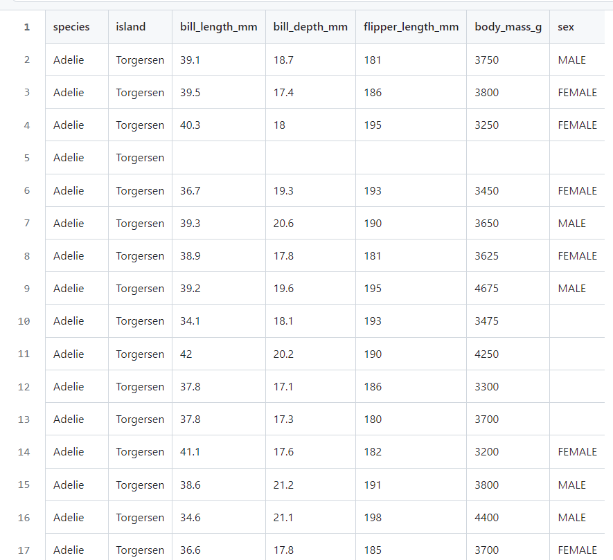

# datafun-06-eda
# Overview
 Project 6 is an opportunity to create your own custom exploratory data analysis (EDA) project using GitHub, Git, Jupyter, pandas, Seaborn and other popular data analytics tools.

 Created By Priyanka Naskar
 
 Date 2/12/2024
# Explore Datasets
ThisEDA will analyze the "penguins" dataset from the Seaborn library. It contains information about  diffrernt types pf penguin specis.you can found this data set in this belowe link

(https://github.com/mwaskom/seaborn-data/blob/master/penguins.csv)

# Deliverable Names
GitHub Repository: datafun-06-eda

Documentation: README.md

Notebook: naskar_eda.ipynb

# Deta set description
In this EDA  the penguins dataset  revealed valuable insights into the characteristics of different penguin species. First, let's load the dataset from the file "penguins.csv" using pandas and have a general overview of it.
Here is some table view of this data set

 # External Dependencies

import numpy as np
import pandas as pd

import matplotlib as mpl
import matplotlib.pyplot as plt

import seaborn as sns
import seaborn.objects as so

# Exploratory Data Analysis

Perform a unique exploratory data analysis project using the tools and skills covered previously.

#  Data Acquisition

import seaborn as sns
df = sns.load_dataset("penguins")

# Inspect first rows of the DataFrame

print(df.head())

# Initial Data Inspection

print(df.head(10))
print(df.shape)
print(df.dtypes)
print(df.info)

# 3. Initial Descriptive Statistics

print(df.describe())

# Initial Data Distribution for Numerical Columns

# Inspect histogram by numerical column

df['bill_length_mm'].hist()

# Inspect histograms for all numerical columns

df.hist()

# Show all plots

plt.show()

# Initial Data Distribution for Categorical Columns
# Inspect value counts by categorical column
df['species'].value_counts()

# Inspect value counts for all categorical columns
for col in df.select_dtypes(include=['object', 'category']).columns:
    # Display count plot
    sns.countplot(x=col, data=df)
    plt.title(f'Distribution of {col}')
    plt.show()

# Show all plots
plt.show()

# Rename column.

def rename_column(df, old_column, new_column):
    df = df.rename(columns={old_column: new_column})
    return df

# Rename the 'bill_length_mm' column to 'bill_length'
df = rename_column(df, 'bill_length_mm', 'bill_length')
#Rename the 'body_mass_g'column to 'body_mass'
df = rename_column(df, 'body_mass_g', 'body_mass')
print(df.dtypes)

# Inserting a column

# Insert a new column 'new_column' with dummy values
df['colour'] = 'black and white'

# Print the DataFrame to verify the new column
print(df.head())

# Step 7. Initial Visualizations
list1 = ["bill_length", "bill_depth_mm", "flipper_length_mm", "body_mass"]
sns.heatmap(df[list1].corr(),annot = True, fmt = ".2f")
plt.show()

sns.scatterplot(x = "bill_length", y = "bill_depth_mm", data = df, hue = "species")
plt.title("Bill Length vs Bill Depth By Species", size=15, color="purple")
plt.show()

sns.scatterplot(x = "bill_length", y = "bill_depth_mm", data = df, hue = "island")
plt.title("Bill Length vs Bill Depth By Island", size=15, color="purple")
plt.show()

# Conclusion
In conclusion, the analysis of the penguins dataset revealed valuable insights into the characteristics of different penguin species. Key findings include variations in bill measurements, body mass, and species distribution. Notably, the dataset exhibited a diverse representation of Adelie, Chinstrap, and Gentoo penguins, with distinct patterns in their physical attributes. Further analysis could explore correlations between features and potentially leverage this information for predictive modeling. Despite the comprehensive exploration, it's essential to acknowledge potential limitations, such as missing values in certain columns. Overall, this analysis serves as a foundation for deeper investigations into penguin biology and behavior.
